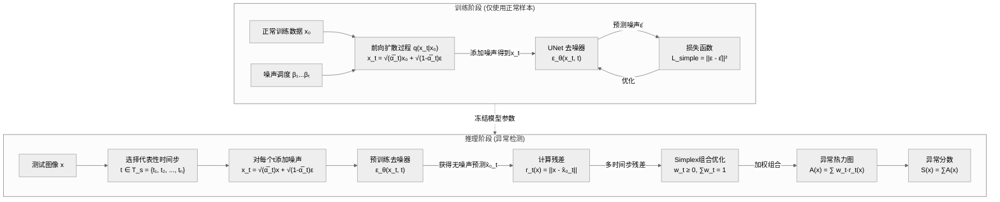
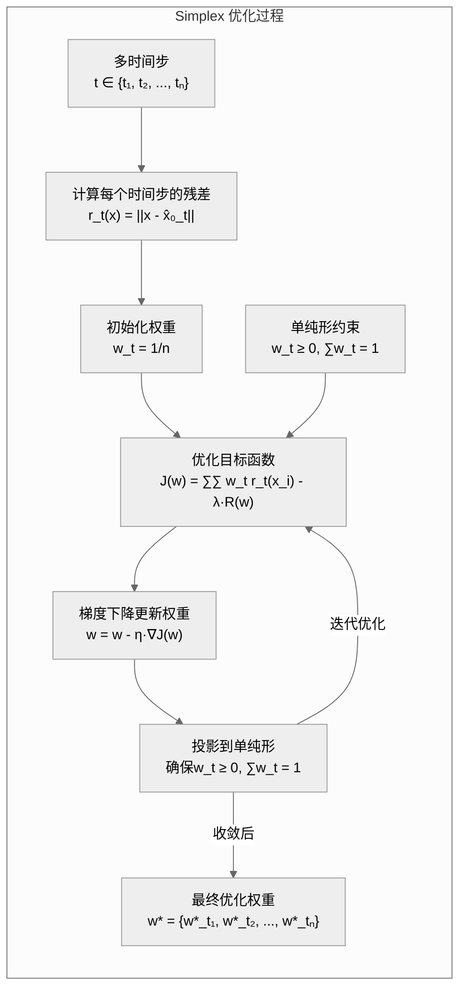
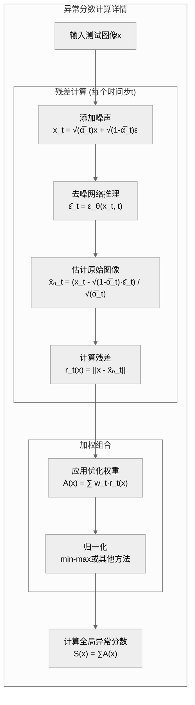

# AnoDDPM 模型架构详解

> 基于论文《Anomaly Detection With Denoising Diffusion Probabilistic Models Using Simplex Noise》的完整架构分析

## 1. 核心架构图（全流程）



## 2. UNet 去噪器架构

```mermaid
%%{init: {'theme': 'neutral', 'flowchart': {'htmlLabels': true}} }%%
flowchart TD
    subgraph UNetArchitecture["UNet ε_θ 详细架构"]
        Input["输入: x_t, t"]
        
        subgraph TimeEmbedding["时间步编码"]
            TimeEmb["时间步投影<br>t → 512维向量"]
            TimeMLP["MLP层<br>512 → 512"]
        end
        
        subgraph Encoder["下采样路径"]
            Conv1["Conv 1: 3 → 128"]
            ResBlock1["ResBlock: 128维<br>+时间条件"]
            Down1["下采样: 128维"]
            ResBlock2["ResBlock: 128 → 256<br>+时间条件"]
            Down2["下采样: 256维"]
            ResBlock3["ResBlock: 256 → 512<br>+时间条件"]
            Down3["下采样: 512维"]
            ResBlock4["ResBlock: 512 → 512<br>+时间条件"]
        end
        
        subgraph Middle["中间层"]
            ResBlockMid1["ResBlock: 512维<br>+时间条件"]
            AttnBlock["自注意力层<br>512维"]
            ResBlockMid2["ResBlock: 512维<br>+时间条件"]
        end
        
        subgraph Decoder["上采样路径"]
            ResBlock5["ResBlock: 1024 → 512<br>+时间条件"]
            Up1["上采样: 512维"]
            ResBlock6["ResBlock: 768 → 256<br>+时间条件"]
            Up2["上采样: 256维"]
            ResBlock7["ResBlock: 384 → 128<br>+时间条件"]
            Up3["上采样: 128维"]
            ResBlock8["ResBlock: 256 → 128<br>+时间条件"]
        end
        
        OutputConv["输出层<br>GroupNorm + SiLU + Conv"]
        Output["输出: 预测噪声 ε̂"]
        
        Input --> TimeEmbedding
        Input --> Conv1
        
        TimeEmb --> TimeMLP
        
        Conv1 --> ResBlock1
        TimeMLP --> ResBlock1
        ResBlock1 --> Down1
        Down1 --> ResBlock2
        TimeMLP --> ResBlock2
        ResBlock2 --> Down2
        Down2 --> ResBlock3
        TimeMLP --> ResBlock3
        ResBlock3 --> Down3
        Down3 --> ResBlock4
        TimeMLP --> ResBlock4
        
        ResBlock4 --> ResBlockMid1
        TimeMLP --> ResBlockMid1
        ResBlockMid1 --> AttnBlock
        AttnBlock --> ResBlockMid2
        TimeMLP --> ResBlockMid2
        
        ResBlockMid2 --> ResBlock5
        TimeMLP --> ResBlock5
        ResBlock4 -.-> |"跳跃连接"| ResBlock5
        ResBlock5 --> Up1
        Up1 --> ResBlock6
        TimeMLP --> ResBlock6
        ResBlock3 -.-> |"跳跃连接"| ResBlock6
        ResBlock6 --> Up2
        Up2 --> ResBlock7
        TimeMLP --> ResBlock7
        ResBlock2 -.-> |"跳跃连接"| ResBlock7
        ResBlock7 --> Up3
        Up3 --> ResBlock8
        TimeMLP --> ResBlock8
        ResBlock1 -.-> |"跳跃连接"| ResBlock8
        
        ResBlock8 --> OutputConv
        OutputConv --> Output
    end
```



## 3. Simplex 优化计算异常分数的详细流程



## 4. 残差计算与生成异常图的细节



## 5. AnoDDPM 关键参数与实现细节

### 5.1 核心参数

| 参数名 | 描述 | 典型值 |
|--------|------|--------|
| T | 扩散总时间步数 | 1000 |
| T_s | 推理时使用的时间步集合 | {t₁,t₂,...,tₙ} 通常n≈5-20 |
| β_t | 噪声调度 | 线性或余弦调度 |
| α_t | 1 - β_t | - |
| α̅_t | ∏ᵏ₌₁ᵗ α_k | - |
| w_t | 时间步t对应的权重 | 通过Simplex优化得到 |
| λ | 正则化系数 | 依实验而定 |

### 5.2 与传统DDPM的差异

1. **训练差异**:
   - 仅使用正常样本进行训练
   - 标准DDPM噪声预测目标
   - 冻结参数用于推理

2. **推理差异**:
   - 多时间步残差计算
   - Simplex优化加权组合
   - 无需采样整个扩散过程

### 5.3 实现技巧

- **时间步选择**: 可基于验证集选择最具区分性的时间步
- **残差计算**: 可选原图x与预测图x̂₀对比，或原噪声ε与预测噪声ε̂对比
- **权重优化**: 使用投影梯度下降保证单纯形约束
- **异常图后处理**: 可应用高斯平滑、阈值处理或CRF细化边界

## 6. 模型训练与评估流程

```mermaid
%%{init: {'theme': 'neutral', 'flowchart': {'htmlLabels': true}} }%%
flowchart TD
    subgraph ModelDevelopmentPipeline["完整开发流程"]
        direction TB
        
        subgraph DataPreparation["数据准备"]
            NormalData["收集正常样本数据集"]
            AugmentData["数据增强<br>(旋转、缩放、裁剪等)"]
            SplitData["划分训练/验证集"]
        end
        
        subgraph ModelTraining["模型训练"]
            InitModel["初始化UNet模型"]
            ConfigDiffusion["配置扩散参数<br>(β调度、时间步数)"]
            TrainLoop["DDPM训练循环<br>(仅正常样本)"]
            SaveModel["保存训练模型"]
        end
        
        subgraph WeightOptimization["权重优化"]
            SelectTimeSteps["选择代表性时间步子集"]
            ComputeValResiduals["计算验证集残差"]
            OptimizeWeights["Simplex约束下优化权重"]
            SaveWeights["保存最优权重"]
        end
        
        subgraph Evaluation["评估与部署"]
            LoadModel["加载训练模型与权重"]
            TestAnomaly["测试集异常检测"]
            EvaluateMetrics["评估指标<br>(AUROC, AP, F1等)"]
            DeployModel["部署模型"]
        end
        
        NormalData --> AugmentData
        AugmentData --> SplitData
        SplitData --> InitModel
        InitModel --> ConfigDiffusion
        ConfigDiffusion --> TrainLoop
        TrainLoop --> SaveModel
        SaveModel --> SelectTimeSteps
        SelectTimeSteps --> ComputeValResiduals
        ComputeValResiduals --> OptimizeWeights
        OptimizeWeights --> SaveWeights
        SaveWeights --> LoadModel
        LoadModel --> TestAnomaly
        TestAnomaly --> EvaluateMetrics
        EvaluateMetrics --> DeployModel
    end
```



## 7. 核心算法伪代码

### 7.1 训练阶段伪代码

```
输入:
- 正常样本数据集 X_normal
- 扩散时间步数 T
- 噪声调度 β₁...βₜ
- 学习率 η

输出:
- 训练好的去噪器 ε_θ

算法:
1. 初始化UNet参数 θ
2. 计算 α_t = 1 - β_t, α̅_t = ∏ᵏ₌₁ᵗ α_k
3. 对于每个epoch:
   a. 对于每个mini-batch x₀ ∈ X_normal:
      i. 随机采样时间步 t ~ Uniform(1, T)
      ii. 随机采样噪声 ε ~ N(0, I)
      iii. 计算噪声样本 x_t = √(α̅_t)·x₀ + √(1-α̅_t)·ε
      iv. 预测噪声 ε̂ = ε_θ(x_t, t)
      v. 计算损失 L = ||ε - ε̂||²
      vi. 更新参数 θ = θ - η·∇_θL
4. 返回训练好的模型 ε_θ
```

### 7.2 Simplex优化伪代码

```
输入:
- 训练好的去噪器 ε_θ
- 验证集 X_val
- 候选时间步集合 T_s = {t₁, t₂, ..., tₙ}
- 学习率 η_w
- 迭代次数 K

输出:
- 最优权重 w*

算法:
1. 初始化权重 w = [1/n, 1/n, ..., 1/n]
2. 对于验证集中的每个样本 x ∈ X_val:
   a. 对于每个时间步 t ∈ T_s:
      i. 添加噪声得到 x_t
      ii. 预测噪声 ε̂_t = ε_θ(x_t, t)
      iii. 计算预测原图 x̂₀_t
      iv. 计算残差图 r_t(x) = ||x - x̂₀_t||
3. 对于K次迭代:
   a. 计算目标函数梯度 ∇J(w)
   b. 更新权重 w = w - η_w·∇J(w)
   c. 投影w到单纯形(确保 w_t ≥ 0, ∑w_t = 1)
4. 返回最优权重 w*
```

### 7.3 异常检测伪代码

```
输入:
- 训练好的去噪器 ε_θ
- 最优权重 w*
- 时间步集合 T_s = {t₁, t₂, ..., tₙ}
- 测试图像 x

输出:
- 异常热力图 A(x)
- 异常分数 S(x)

算法:
1. 对于每个时间步 t ∈ T_s:
   a. 添加噪声得到 x_t = √(α̅_t)·x + √(1-α̅_t)·ε
   b. 预测噪声 ε̂_t = ε_θ(x_t, t)
   c. 估计原图 x̂₀_t = (x_t - √(1-α̅_t)·ε̂_t) / √(α̅_t)
   d. 计算残差 r_t(x) = ||x - x̂₀_t||
2. 计算加权异常图 A(x) = ∑ w*_t·r_t(x)
3. 计算全局异常分数 S(x) = ∑A(x)
4. 返回异常热力图A(x)和异常分数S(x)
```

## 8. 结论与优势

1. **无需异常样本**: 完全无监督方法，仅需正常样本即可训练
2. **高质量定位**: 可生成像素级异常热力图
3. **灵活适应性**: Simplex组合可自适应权重不同时间步的残差贡献
4. **理论基础扎实**: 基于扩散模型的生成性理解
5. **计算效率**: 推理时仅需少量时间步，无需完整扩散过程

---

*注: 该架构图基于论文《Anomaly Detection With Denoising Diffusion Probabilistic Models Using Simplex Noise》及相关实现。详细超参数和精确值可能因具体实现而有所差异。*
